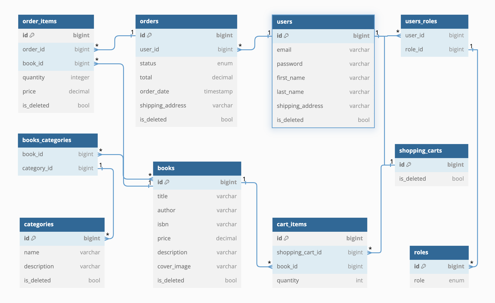

# Bookstore
***
This RESTful API organizes management for an online bookstore.
Afford customers to search for desired books,
view books by sections of the bookshelf, make purchases of books
by adding them to the cart, and also view the purchase history.
App provide for managers the opportunity arrange books, organize bookshelf sections,
look at and change receipts.

### Domain models
* **User:** *Contains information about the registered user 
including their authentication details and personal information.*
* **Role:** *Represents the role of a user in the system, for example,
admin or user.*
* **Book:** *Represents a book available in the store.*
* **Category:** *Represents a category that a book can belong to.*
* **ShoppingCart:** *Represents a user's shopping cart.*
* **CartItem:** *Represents an item in a user's shopping cart.*
* **Order:** *Represents an order placed by a user.*
* **OrderItem:** Represents an item in a user's order.

### People involved:
* **Shopper (User):** *Someone who looks at books, puts them in a basket (shopping cart), 
and buys them.*
* **Manager (Admin):** *Someone who arranges the books on the shelf and watches what gets bought*.

## Technologies & tools
***
* Java
* Spring Boot
* Spring Security
* Spring Data JPA
* Docker
* JWT
* Junit
* Liquibase
* Lombok
* Mapstruct
* MySql
* Swagger

## Structure
***


## How to run app
***
### Requirements
* Git
* Maven
* Java 17+
* Docker

### Set up
1. Clone the project from the GitHub:

    ```$ git clone https://github.com/furthernull/book-store.git```
  
2. Go to root directory with project:

    ```$ cd book-store```

3. Create and fulfill `.env` file in the root folder with project:

   ###### example of .env file
   ```
   MYSQLDB_USER=mysql_database_user
   MYSQLDB_PASSWORD=password
   MYSQLDB_ROOT_PASSWORD=sql_database_password
   MYSQLDB_DATABASE=book_store
   MYSQLDB_LOCAL_PORT=3307
   MYSQLDB_DOCKER_PORT=3306

   SPRING_LOCAL_PORT=8088
   SPRING_DOCKER_PORT=8080
   DEBUG_PORT=5005
   ```
4. Build the project you can run the command:

   ```$ mvn clean install```

5. Build the image, run docker command:

   ```$ docker-compose build```

6. Run container:

   ```$ docker-compose up```

### Interaction and explore
***
For test functionalities and explore the feature via [swagger](https://swagger.io/).
To do this, run the app and follow this link
[http://localhost:8088/api/swagger-ui/index.html](http://localhost:8088/api/swagger-ui/index.html).
For authenticate, use credentials: username `admin@bookapp.com` 
and password `password`, (this is registered default admin user).  


Also, opportunity interact through any http-client such as 
[postman](https://www.postman.com/).

### The list of HTTP requests:

- **Authentication controller**

| HTTP-method | url                                  | description             |
|-------------|--------------------------------------|-------------------------|
| **POST**    | localhost:8088/api/auth/login        | *login registered user* |
| **POST**    | localhost:8088/api/auth/registration | *register new user*     |

- **Category controller**

| HTTP-method | url                                      | description                   |
|-------------|------------------------------------------|-------------------------------|
| **POST**    | localhost:8088/api/categories            | *create category*             |
| **GET**     | localhost:8088/api/categories            | *get all categories*          |
| **GET**     | localhost:8088/api/categories/{id}       | *get categories by id*        |
| **PUT**     | localhost:8088/api/categories/{id}       | *update category(admin only)* |
| **DEL**     | localhost:8088/api/categories/{id}       | *delete category(admin only)* |
| **GET**     | localhost:8088/api/categories/{id}/books | *get books by category id*    |

- **Book controller**

| HTTP-method | url                             | description      |
|-------------|---------------------------------|------------------|
| **POST**    | localhost:8088/api/books        | *create book*    |
| **GET**     | localhost:8088/api/books        | *get all books*  |
| **GET**     | localhost:8088/api/books/{id}   | *get book by id* |
| **GET**     | localhost:8088/api/books/search | *search book*    |
| **PUT**     | localhost:8088/api/books/{id}   | *update book*    |
| **DEL**     | localhost:8088/api/books/{id}   | *delete book*    |

- **Shopping cart controller**

| HTTP-method | url                                        | description         |
|-------------|--------------------------------------------|---------------------|
| **POST**    | localhost:8088/api/cart                    | *add book*          |
| **GET**     | localhost:8088/api/cart                    | *get shopping cart* |
| **GET**     | localhost:8088/api/cart/items/{cartItemId} | *update cart items* |
| **DEL**     | localhost:8088/api/cart/items/{cartItemId} | *delete cart items* |

- **Order controller**

| HTTP-method | url                                            | description                        |
|-------------|------------------------------------------------|------------------------------------|
| **POST**    | localhost:8088/api/orders                      | *place order*                      |
| **GET**     | localhost:8088/api/orders                      | *get order history*                |
| **GET**     | localhost:8088/api/orders/{orderId}/items      | *get order details*                |
| **GET**     | localhost:8088/api/orders/{orderId}/items/{id} | *get specific item*                |
| **PATCH**   | localhost:8088/api/orders/{id}/                | *update order details(admin only)* |

### Testing
***
Run test, execute the comand:

   ```$ mvn test```

## Contributing
***
Pull requests are welcome. For major changes, please open an issue first
to discuss what you would like to change.

Please make sure to update tests as appropriate.